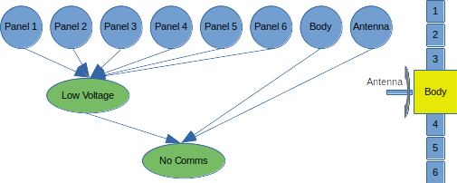
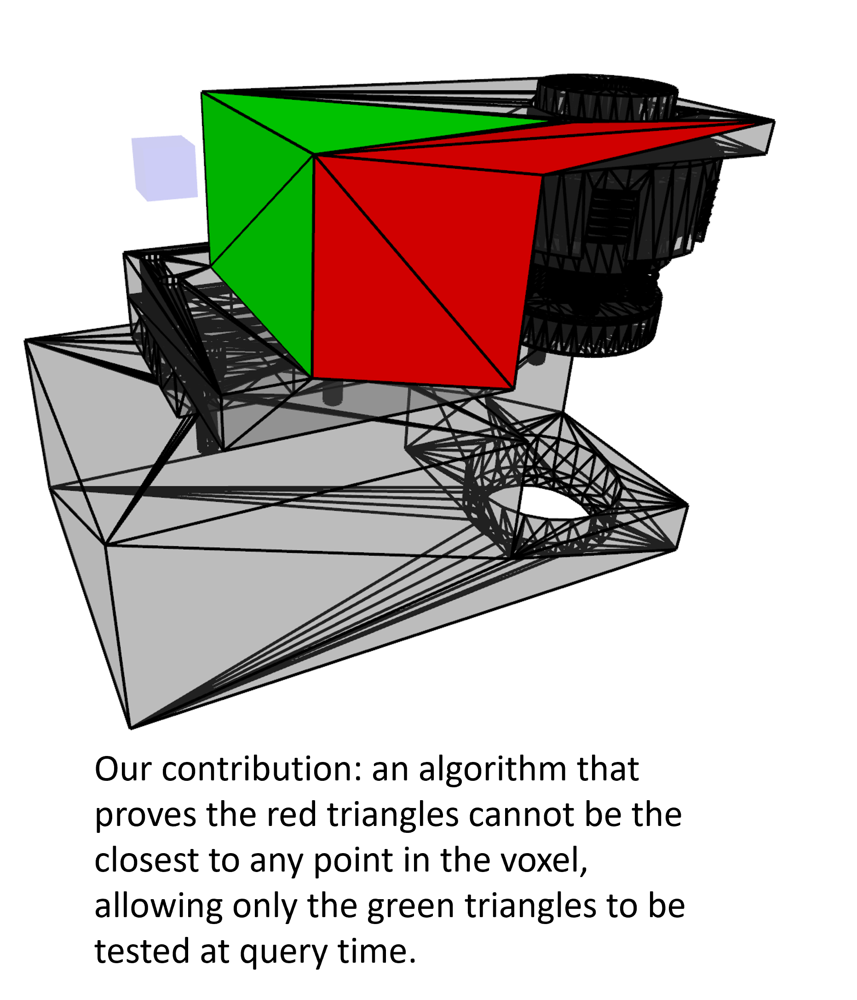

Intelligent Inspection addresses a key knowledge gap in satellite servicing: what is wrong with the satellite? At present many satellite failures go unexplained due to limited onboard sensing and a near-total lack of inspection capabilities on-orbit. It is critical that a robotic servicer fully characterize the status of a client satellite before attempting repairs; the servicer must determine both which parts have malfunctioned and which components are still working (and so should not be interfered with). Classic robotic inspection tends to be a passive task where a sensor passes over all (or at least as many as possible) points on a target surface. This is an “uninformed” process. An informed approach can enhance situational awareness and allow our limited resources to focus on the more critical areas associated with an inspection process. Drawing from the multi-objective optimization community, our work advances the state of the art in robotic search by including multiple, and perhaps competing, search criteria, such as different types of defects, energy used to search, etc. Moreover, our approach to search pushes interactive inspection to the limit by not only “looking” but also “touching,” when necessary to assess system status. Finally, all of this is done in the context of assured safety of the client satellite’s components and system, at large.

# Bayesian Networks for Information-Driven Inspection
Effective inspections should follow automatically generated inspection trajectories that leverage prior knowledge about where failures may have occurred on the client satellite. This prior knowledge may be encoded as a belief distribution. We propose a Bayesian network formulation, which can be learned from data or built from expert knowledge, to encode how this belief should be updated during inspection. When the inspection agent receives a measurement of the status of a component of the client, an incremental Bayes Net inference based on the junction tree algorithm is used to update the belief as to the status of each component recorded in the network.

# Fast Point to Mesh Distance for Articulated Body Estimation
Computing the distance from a point to the surface of a triangular mesh is a key step in many robotics algorithms, including collision checking and point cloud registration. In many applications, distance computations represent a large part of the runtime expense of the algorithm. Our contribution is an algorithm to compute for a voxel a near-minimal set of triangles (see figure) that is nevertheless guaranteed to include the triangle closest to any given point in the voxel. By recording these triangle sets for a voxelization of the volume around a mesh, very fast point-to-mesh distance queries are possible. For more information, see our [paper](http://biorobotics.ri.cmu.edu/papers/paperUploads/Point_To_Mesh_Distance_IROS_v6_Geordan.pdf) at IROS2023. This approach has been [open-sourced](https://github.com/biorobotics/point2mesh-prune)

